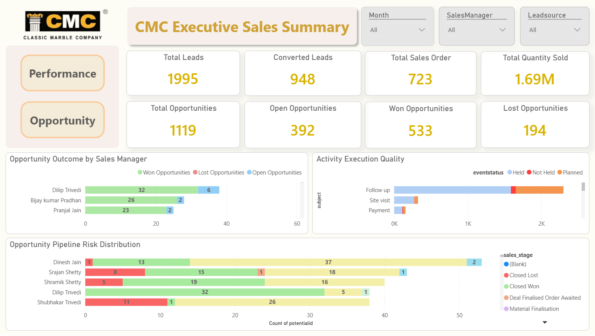
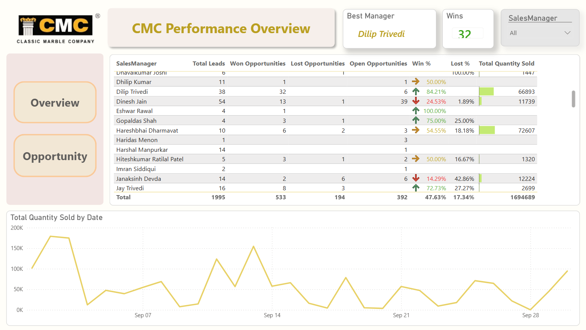
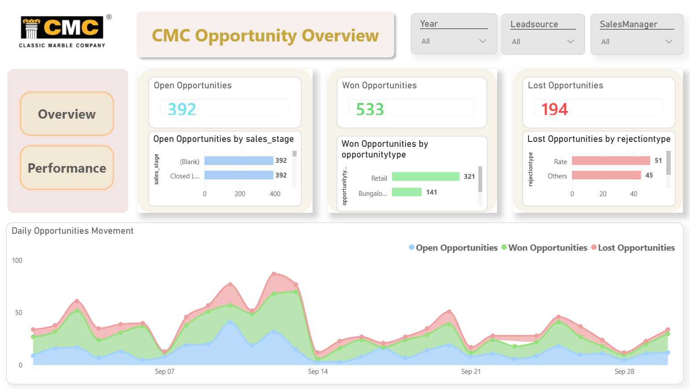

# Sales Analytics Dashboard (Power BI)

## Project Overview
Developed an interactive Business Intelligence dashboard using Power BI to analyze sales performance, monitor KPIs, and generate actionable insights for business decision-making.

## Key Features
- KPI Tracking: Total Leads, Opportunities, Sales Orders, Quantity Sold
- Opportunity Analysis: Open, Won, and Lost Opportunities
- Sales Performance Analysis by Manager
- Conversion Rate and Win/Loss Analysis
- Opportunity Pipeline Risk Distribution
- Daily Trends Analysis of Sales and Opportunities
- Interactive Filters (Month, Sales Manager, Lead Source)

## Tools & Technologies
- Power BI
- SQL
- DAX
- Data Modeling (Star Schema)

## Dashboard Screenshots

### Overview Dashboard

### Performance Dashboard

### Opportunity Dashboard

## Key Insights
- Identified top-performing sales managers based on win percentage
- Analyzed opportunity pipeline to reduce potential revenue loss
- Monitored daily trends to improve sales planning and forecasting
- Enabled data-driven decision-making using KPI dashboards
